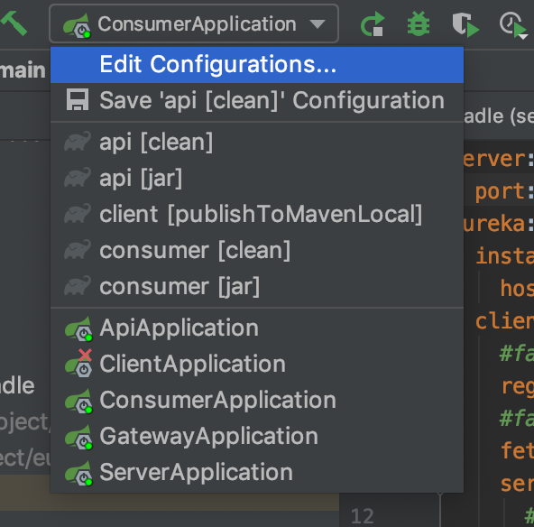

# spring-eureka-feign-demo
了解spring cloud开发模式demo

> 应用服务 gateway / server(eureka) / api / server / consumer / client 图解


### 关于配置注意事项
- Client 项目的重要配置
```
# file: client/build.gradle
publishToMavenLocal(... # 执行此方法将jar包推送至本地仓库
```
- Api / Consumer 项目的引入配置
```
# file: (consumer/api)/build.gradle
implementation 'cn.feiyu:client:0.0.1-SNAPSHOT' # 在依赖中加入client包地址
# file: (consumer/api)/src/main/resources/application.yml
声明应用对外端口、应用实例名称和连接注册服务
```
- Eureka / Gateway 配置均参考 Api 所指向的两个配置文件

### 如何启动服务
> 启动顺序 server(Eureka) > gateway > api > consumer

- 方法一：命令行启动
    * 参见：api/gradlew 命令
    
- 方法二：IDE 启动
    - 启动应用服务

    - Client发布到本地代码库


### 项目涉及到的核心 spring 组件
- spring-boot-starter-web
- spring-cloud-starter
- spring-cloud-starter-netflix-eureka-client
- spring-cloud-starter-openfeign
- spring-boot-starter-test
- spring-cloud-starter-gateway
- spring-cloud-starter-netflix-eureka-server
